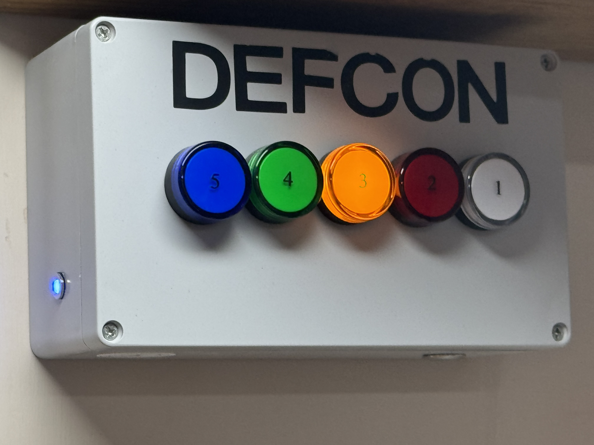

# ESP32-DEFCON

This code is designed to provide DEFCON lights in teh style of US DoD DEFCON levels 1 to 5. This is an example.

The build works on a range of ESP32 modules, and uses GPIOs for :-0

- Five DEFCON lights (1 to 5)
- Clicker relay
- Beeper
- Blinker LED

Many "relay" modules are ideal for this, and the general [Relay module](https://github.com/revk/SolarSystem/tree/master/PCB/Output).

Settings allow you to specify the GPIOs for all of these, and allow a `-` prefix for inverted working.

## Operation

The simplest state is a DEFCON level `1` to `5` which just means the corresponding light is lit.

Changing to a worse (lower) level, causes the LED to go off, and the new LED to come on. This is accompanied by a relay *click*. Then there is a double beep.

Changing to a better (higher) level does the same but with one beep.

## Level 0

DECFON levels are `1` to `5`, but we support level `0` which is all lights on to indicate worst case. They light up in a rapid sequence when set to level `0` and have a tripple beep.

## Level 6+

DECFON levels are `1` to `5`, but we support level `6` (or higher) which are no lights lit, to indicate best case.

## Beeps and blinks

Beeps can be turned off when above a DEFCON level in a setting, so only beeping when level goes to a more serious level.

Blinking is normally on, but can also be set to only apply below a certain DEFCON level.

## HTTP working

Access the IP via `http://` with a query, e.g. `?1` to set DEFCON `1`, you can also use `?+` or `?-` to increase or decres level.

## MQTT working

The `topic` can set set, but defaults to `DEFCON`.

There are two ways or working.

### Direct level set

Simple send `DEFCON/3`, with no payload, to set DEFCON to 3, etc.

### Implied level set

Turn on or off a DEFCON level by sending `DEFCON/3` with a payload of `0` or `1`. You can set each level independantly. Typically with retained messages. The actual DEFCON level applied is the lowest (i.e. worst) that is set.